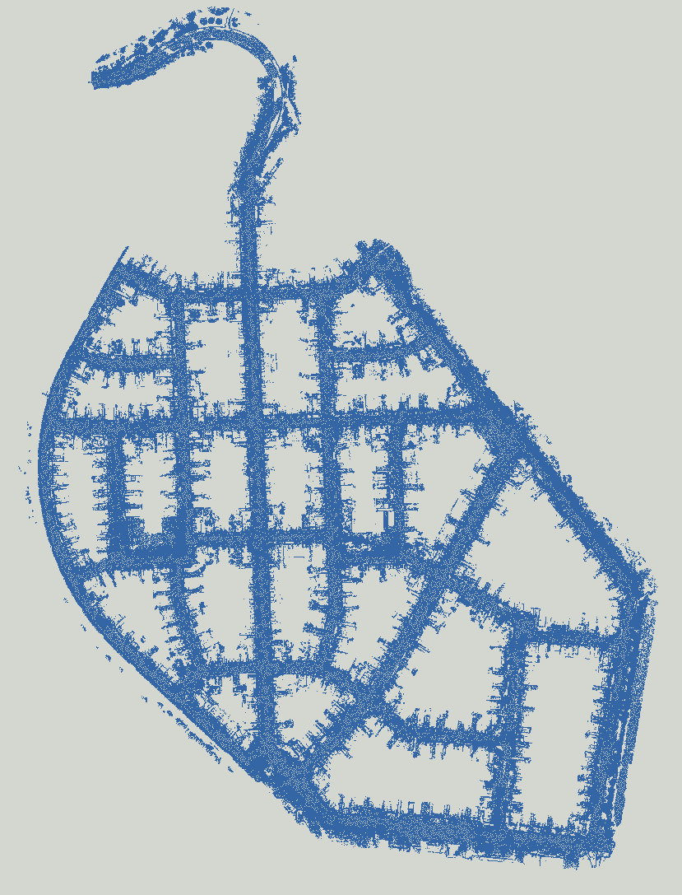

<div align="center">
    <h1>KITTI-360 Map Generator</h1>
</div>

---

Just accumulate the scans, and maps


## How to use

After building the repository, follow the template:

```
./main <directory> <voxel size> <output path name>

```

E.g., 

```
./main /media/shapelim/UX960NVMe1/KITTI-360/data_3d_semantics/train/2013_05_28_drive_0009_s
ync/static 0.1 output.pcd
```

## Result



